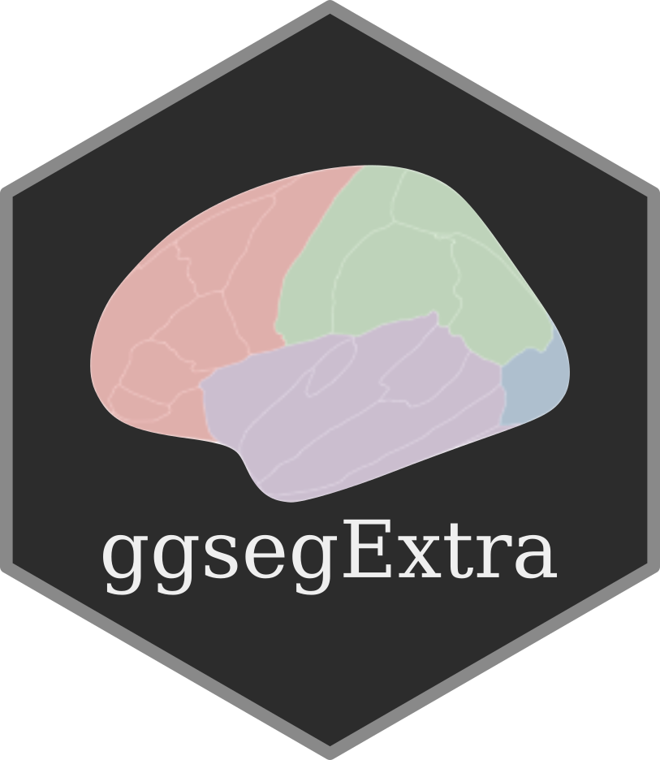

<!-- README.md is generated from README.Rmd. Please edit that file -->

# ggsegExtra 

<!-- badges: start -->

[](https://codecov.io/gh/ggseg/ggsegExtra)
[](https://CRAN.R-project.org/package=ggsegExtra)
[](https://www.tidyverse.org/lifecycle/#stable)
[](https://github.com/LCBC-UiO/ggsegExtra/actions)
<!-- badges: end -->

This package contains information on verified atlases compatible for use
in [ggseg](https://ggseg.github.io/ggseg) and
[ggseg3d](https://ggseg.github.io/ggseg3d) plotting packages in R. It
also contains functions and pipelines to create custom atlases.

## Installing

We recommend installing this package from its
[r-universe](https://ggseg.r-universe.dev/ui#builds) build:

``` r
# Enable this universe
options(repos = c(
    ggseg = 'https://ggseg.r-universe.dev',
    CRAN = 'https://cloud.r-project.org'))

# Install some packages
install.packages('ggsegExtra')
```

Alternatively, install the package with the remotes package from github.

``` r
# install.packages("remotes")
remotes::install_github("ggseg/ggsegExtra")
```

## Atlases

There are currently 11 available atlases across 11 packages. The
packages, their repository name and location can be found with:

### [`ggsegJHU`](https://github.com/ggseg/ggsegJHU)

[](https://CRAN.R-project.org/package=ggsegJHU)

JHU datasets for the ggseg-plotting toolThis is a support package for
the ggseg, and ggseg3d packages. It contains the JHU atlases to plot
using functions from those two packages.

### [`ggsegHO`](https://github.com/ggseg/ggsegHO)

[](https://CRAN.R-project.org/package=ggsegHO)

Harvard-Oxford datasets for the ggseg-plotting toolThis is a support
package for the ggseg, and ggseg3d packages. It contains the
Harvard-Oxford cortical atlases to plot using functions from those two
packages.

### [`ggsegICBM`](https://github.com/ggseg/ggsegICBM)

[](https://CRAN.R-project.org/package=ggsegICBM)

ICBM datasets for the ggseg-plotting toolThis is a support package for
the ggseg, and ggseg3d packages. It contains the ICBM atlases to plot
using functions from those two packages.

### [`ggsegDefaultExtra`](https://github.com/ggseg/ggsegDefaultExtra)

[](https://CRAN.R-project.org/package=ggsegDefaultExtra)

Extra dk and aseg datasets for the ggseg-plotting toolThis is a support
package for the ggseg, and ggseg3d packages. It contains the extra dk
and aseg, with some minor differences from the original atlases to plot
using functions from those two packages.

### [`ggsegDKT`](https://github.com/ggseg/ggsegDKT)

[](https://CRAN.R-project.org/package=ggsegDKT)

Desikan-Killiany-Tourville datasets for the ggseg-plotting toolThis is a
support package for the ggseg, and ggseg3d packages. It contains the DKT
atlases to plot using functions from those two packages.

### [`ggsegTracula`](https://github.com/ggseg/ggsegTracula)

[](https://CRAN.R-project.org/package=ggsegTracula)

Tracula datasets for the ggseg-plotting toolThis is a support package
for the ggseg, and ggseg3d packages. It contains the Tracula atlases to
plot using functions from those two packages.

### [`ggsegChen`](https://github.com/ggseg/ggsegChen)

[](https://CRAN.R-project.org/package=ggsegChen)

Chen datasets for the ggseg-plotting toolThis is a support package for
the ggseg, and ggseg3d packages. It contains the Chen atlases to plot
using functions from those two packages.

### [`ggsegDesterieux`](https://github.com/ggseg/ggsegDesterieux)

[](https://CRAN.R-project.org/package=ggsegDesterieux)

Desterieux datasets for the ggseg-plotting toolThis is a support package
for the ggseg, and ggseg3d packages. It contains the Desterieux atlases
to plot using functions from those two packages.

### [`ggsegSchaefer`](https://github.com/ggseg/ggsegSchaefer)

[](https://CRAN.R-project.org/package=ggsegSchaefer)

Schaefer datasets for the ggseg-plotting toolThis is a support package
for the ggseg, and ggseg3d packages. It contains the Schaefer atlases to
plot using functions from those two packages.

### [`ggsegGlasser`](https://github.com/ggseg/ggsegGlasser)

[](https://CRAN.R-project.org/package=ggsegGlasser)

Glasser datasets for the ggseg-plotting toolThis is a support package
for the ggseg, and ggseg3d packages. It contains the Glasser atlases to
plot using functions from those two packages.

### [`ggsegYeo2011`](https://github.com/ggseg/ggsegYeo2011)

[](https://CRAN.R-project.org/package=ggsegYeo2011)

Yeo 2011 Datasets for the ‘ggseg’-PackageThis is a support package for
the ggseg, and ggseg3d packages. It contains the Yeo 2011 atlases to
plot using functions from those two packages.

We have tutorials on how to make atlases available in the `Articles` of
the [package documentation page](https://ggseg.github.io/ggsegExtra/).
Currently, the pipeline for making 3d atlases needs FreeSufer to be
installed on your system and a ready `.annot` file to use for the
conversions. Improvements to the pipeline in creating cortical atlases
both for ggseg and ggseg3d is still being developed. Pipelines for
creating sub-cortical atlases of any kind are still in their infancy,
and we do not yet have good solutions for their creation. Suggestions
for improvement are welcome through GH issues or direct Pull requests.

## Code of Conduct

Please note that the ggsegExtra project is released with a [Contributor
Code of
Conduct](https://www.contributor-covenant.org/version/1/0/0/code-of-conduct.html).
By contributing to this project, you agree to abide by its terms.

### Report bugs or requests

Don’t hesitate to ask for support using [github
issues](https://github.com/ggseg/ggsegExtra/issues), or requesting new
atlases. While we would love getting help in creating new atlases, you
may also request atlases through the issues, and we will try to get to
it.

# Funding

This work is funded by **EU Horizon 2020 Grant** *‘Healthy minds 0-100
years: Optimizing the use of European brain imaging cohorts
(Lifebrain)’*, with grant agreement `732592`. The project has also
received funding from the **European Research Council**’s *Starting
grant* (grant agreements `283634`, to Anders Martin Fjell and `313440`
to Kristine Beate Walhovd) and *Consolidator Grant* (grant agreement
`771355` to Kristine Beate Walhovd and `725025` to Anders Martin Fjell).
The project has received funding through multiple grants from the
Norwegian Research Council.
