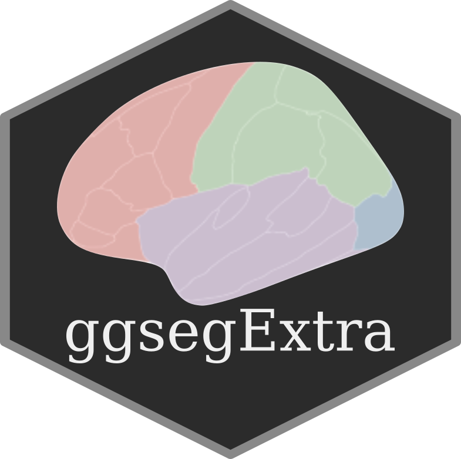

<!-- README.md is generated from README.Rmd. Please edit that file -->

<!-- badges: start -->

[](https://travis-ci.com/LCBC-UiO/ggsegExtra)
[](https://ci.appveyor.com/project/LCBC-UiO/ggsegExtra)
[](https://codecov.io/gh/LCBC-UiO/ggsegExtra)
[](https://CRAN.R-project.org/package=ggsegExtra)
[](https://www.tidyverse.org/lifecycle/#stable)
<!-- badges: end -->

# ggsegExtra 

This package contains extra atlases for the use in the [ggseg]()
plotting package in R.

## Atlases

There are currently 19 available atlases across 10 packages. The
packages, their repository name and location can be found with:

``` r
library(ggsegExtra)

# List all verified compatible atlases
ggseg_atlas_repos()
#> # A tibble: 10 x 5
#>    repo                ggseg ggseg3d source comment                             
#>    <chr>               <lgl> <lgl>   <chr>  <chr>                               
#>  1 LCBC-UiO/ggsegYeo2… TRUE  TRUE    github both 17 and 7 Network data          
#>  2 LCBC-UiO/ggsegDest… FALSE TRUE    github the 2009 atlas                      
#>  3 LCBC-UiO/ggsegChen  FALSE TRUE    github both thickness and area maps        
#>  4 LCBC-UiO/ggsegScha… FALSE TRUE    github both 17 and 7 networks              
#>  5 LCBC-UiO/ggsegGlas… TRUE  TRUE    github full atlas                          
#>  6 LCBC-UiO/ggsegJHU   TRUE  TRUE    github white tract atlas                   
#>  7 LCBC-UiO/ggsegTrac… TRUE  TRUE    github white tract atlas                   
#>  8 LCBC-UiO/ggsegICBM  FALSE TRUE    github white tract atlas                   
#>  9 LCBC-UiO/ggsegHO    TRUE  FALSE   github Harvard-Oxford cortical (FSL)       
#> 10 LCBC-UiO/ggsegDefa… TRUE  FALSE   github extra 2d view for dk, p/a division …
```

We have two tutorials on how to make atlases available in the [package
documentation page](https://lcbc-uio.github.io/ggsegExtra/). Currently,
the pipeline for making 3d atlases is complete given Freesufer is
installed on your system and you have a ready `.annot` file to use for
the converions. Creating 2d atlases is currently still a work in
progress, and we are not able to provide a better solution than the one
described at the moment. We hope to remedy this in the near future.

## Code of Conduct

Please note that the ggsegExtra project is released with a [Contributor
Code of
Conduct](https://www.contributor-covenant.org/version/1/0/0/code-of-conduct.html).
By contributing to this project, you agree to abide by its terms.

### Report bugs or requests

Don’t hesitate to ask for support using [github
issues](https://github.com/LCBC-UiO/ggsegExtra/issues), or requesting
new atlases. While we would love getting help in creating new atlases,
you may also request atlases through the issues, and we will try to get
to it.

# Funding

This tool is partly funded by:

**EU Horizon 2020 Grant:** Healthy minds 0-100 years: Optimising the use
of European brain imaging cohorts (Lifebrain).

**Grant agreement number:** 732592.

**Call:** Societal challenges: Health, demographic change and well-being
