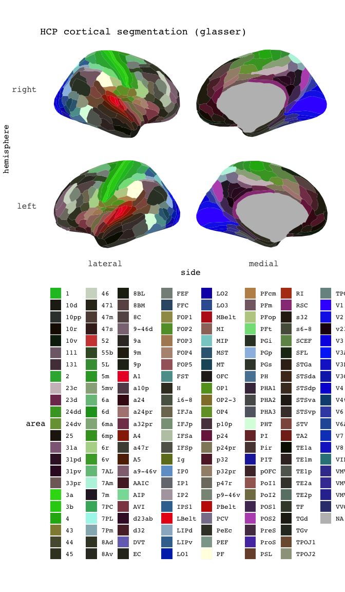

Extra atlases for ggseg-package
================
Athanasia Mowinckel & Didac Vidal Pineiro

[](https://travis-ci.com/LCBC-UiO/ggsegExtra)
[](https://codecov.io/gh/LCBC-UiO/ggsegExtra)

This package contains extra atlases for the use in the [ggseg]()
plotting package in R. \#\# Atlases There are currently three atlases
available in the package:

### 2d polygon atlases

1.  `midsagittal` - mid-sagittal slice showing the cerebellum,
    3<sup>rd</sup> and 4<sup>th</sup> ventricles, corpus callosum etc.
2.  `glasser` - HCP cortical segmentation (Glasser et al. 2015)  
3.  `jhu`- JHU white-matter tractography atlas  
4.  `yeo7`- Yeo et al. 7 resting state networks
5.  `yeo17`- Yeo et al. 17 resting state networks

### 3d mesh atlases

1.  `glasser_3d` - HCP cortical segmentation (Glasser et al. 2015)  
2.  `desterieux_3d` - Desterieux et al. cortical segmentation
3.  `yeo7_3d` - Yeo et al. 7 resting state networks
4.  `yeo17_3d`- Yeo et al. 17 resting state networks
5.  `schaefer7`- Schaefer et al. 7 resting state networks
6.  `schaefer17`- Schaefer et al. 17 resting state networks

We are working on creating a detailed description in the wiki on how to
create and contribute atlases to the package. The `ggseg` function
already allows you to provide it with a data.frame of a custom atlas if
you have it, but it must correspond to certain specifications to work.

Please see the
[wiki](https://github.com/LCBC-UiO/ggseg/wiki/Creating-and-contributing-atlases)
for information on adding atlases, or inspect the included datasets for
requirements. If anything is unclear in the wiki, give us a shout out in
the issues\!

## Use

You will need to use the `ggseg` package to use these atlases, or
wrangle them your self. You can access it
[here](https://lcbc-uio.github.io/ggseg/ggseg.html), or via R:

``` r
devtools::install_github("LCBC-UiO/ggseg")
```

### Report bugs or requests

Don’t hesitate to ask for support using [github
issues](https://github.com/LCBC-UiO/ggseg/issues), or requesting new
atlases. While we would love getting help in creating new atlases, you
may also request atlases through the issues, and we will try to get to
it.

### Included atlases and palettes

<!-- -->

<!-- -->

<!-- -->

# Funding

This tool is partly funded by:

**EU Horizon 2020 Grant:** Healthy minds 0-100 years: Optimising the use
of European brain imaging cohorts (Lifebrain).

**Grant agreement number:** 732592.

**Call:** Societal challenges: Health, demographic change and well-being
