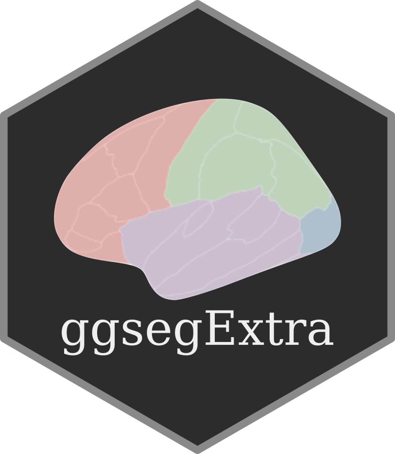

<!-- README.md is generated from README.Rmd. Please edit that file -->

# ggseg.extra 

<!-- badges: start -->

[](https://github.com/ggsegverse/ggseg.extra/actions/workflows/test-coverage.yaml)
[](https://lifecycle.r-lib.org/articles/stages.html)
[](https://github.com/ggsegverse/ggseg.extra/actions)
<!-- badges: end -->

This package provides pipelines for creating brain atlas data sets
compatible with the [ggseg](https://ggsegverse.github.io/ggseg/) and
[ggseg3d](https://ggsegverse.github.io/ggseg3d/) plotting packages in R.

## Installing

Install the development version from
[r-universe](https://ggsegverse.r-universe.dev/#builds):

``` r
options(
  repos = c(
    ggsegverse = "https://ggsegverse.r-universe.dev",
    CRAN = "https://cloud.r-project.org"
  )
)
install.packages("ggseg.extra")
```

Or from GitHub:

``` r
# install.packages("remotes")
remotes::install_github("ggsegverse/ggseg.extra")
```

### Development version of freesurfer

The atlas creation functions require the development version of the
freesurfer R package, which is not yet on CRAN. Install it from GitHub:

``` r
pak::pak("muschellij2/freesurfer")
```

## Create custom atlases

Tutorials are available in the `Articles` of the [package documentation
page](https://ggsegverse.github.io/ggseg.extra/). The cortical pipeline
projects inflated mesh triangles directly to 2D polygons — atlas
creation takes seconds and needs only FreeSurfer to read annotation
files (no rendering, ImageMagick, or Chrome). Subcortical and tract
pipelines are also available. Suggestions for improvement are welcome
through GH issues or direct Pull requests.

## Code of Conduct

Please note that the ggseg.extra project is released with a [Contributor
Code of
Conduct](https://www.contributor-covenant.org/version/1/0/0/code-of-conduct.html).
By contributing to this project, you agree to abide by its terms.

### Report bugs or requests

Don’t hesitate to ask for support using [github
issues](https://github.com/ggsegverse/ggseg.extra/issues), or requesting
new atlases. While we would love getting help in creating new atlases,
you may also request atlases through the issues, and we will try to get
to it.

# Funding

This work is funded by **EU Horizon 2020 Grant** *‘Healthy minds 0-100
years: Optimizing the use of European brain imaging cohorts
(Lifebrain)’*, with grant agreement `732592`. The project has also
received funding from the **European Research Council**’s *Starting
grant* (grant agreements `283634`, to Anders Martin Fjell and `313440`
to Kristine Beate Walhovd) and *Consolidator Grant* (grant agreement
`771355` to Kristine Beate Walhovd and `725025` to Anders Martin Fjell).
The project has received funding through multiple grants from the
Norwegian Research Council.
