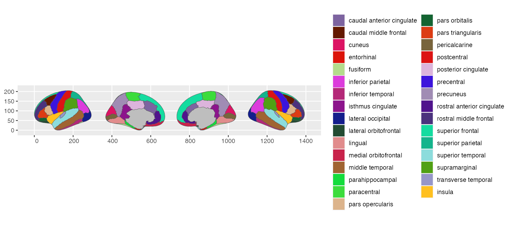

# Using ggsegExtra atlases

Using the ggseExtra package requires the two main ggseg-packages,
containing the functions needed to plot the data. ggsegExtra is a
meta-repository of data-sets that fit with the functions in those main
packages, with functions to help you create your own custom atlases.

``` r
library(ggsegExtra)
## Loading required package: ggseg
## Loading required package: ggseg3d
## Warning in rgl.init(initValue, onlyNULL): RGL: unable to open X11 display
## Warning: 'rgl.init' failed, will use the null device.
## See '?rgl.useNULL' for ways to avoid this warning.
```

## Installing atlases

Atlases are stored in their own online repositories. The list of
repositories is periodically updated based on when we have confirmed a
new atlas that works with the packages. These data-sets can be in our
own github account (ggseg), and we are happy to add new repositories
contributed by others here. To see all confirmed atlases:

``` r
ggseg_atlas_repos()
## # A tibble: 28 × 81
##    `_type` `_user` Package     Maintainer `_published` `_upstream` `_registered`
##    <chr>   <chr>   <chr>       <chr>      <chr>        <chr>       <lgl>        
##  1 failure ggseg   ggsegExtra  Athanasia… 2026-01-31T… https://gi… TRUE         
##  2 src     ggseg   ggseg       Athanasia… 2026-01-24T… https://gi… TRUE         
##  3 src     ggseg   freesurfer  John Musc… 2026-01-13T… https://gi… TRUE         
##  4 src     ggseg   ggsegTracu… Athanasia… 2026-01-22T… https://gi… TRUE         
##  5 src     ggseg   ggseg3d     Athanasia… 2026-01-16T… https://gi… TRUE         
##  6 failure ggseg   rgdal       Roger Biv… 2026-01-28T… https://gi… TRUE         
##  7 src     ggseg   ggsegYeo20… Athanasia… 2026-01-30T… https://gi… TRUE         
##  8 src     ggseg   ggsegICBM   Athanasia… 2026-01-18T… https://gi… TRUE         
##  9 src     ggseg   ggsegSchae… Athanasia… 2026-01-24T… https://gi… TRUE         
## 10 src     ggseg   ggsegChen   Athanasia… 2026-01-22T… https://gi… TRUE         
## # ℹ 18 more rows
## # ℹ 74 more variables: `_commit` <df[,5]>, `_maintainer` <df[,8]>,
## #   `_distro` <chr>, `_jobs` <list>, `_host` <chr>, `_buildurl` <chr>,
## #   `_created` <chr>, `_owner` <chr>, `_selfowned` <lgl>, `_universes` <list>,
## #   `_nocasepkg` <chr>, `_failure` <df[,5]>, `_binaries` <list>, Title <chr>,
## #   Version <chr>, `Authors@R` <chr>, Description <chr>, License <chr>,
## #   Encoding <chr>, RoxygenNote <chr>, LazyData <chr>, …

# Search for repos with pattern
ggseg_atlas_repos("Yeo")
## # A tibble: 1 × 81
##   `_type` `_user` Package      Maintainer `_published` `_upstream` `_registered`
##   <chr>   <chr>   <chr>        <chr>      <chr>        <chr>       <lgl>        
## 1 src     ggseg   ggsegYeo2011 Athanasia… 2026-01-30T… https://gi… TRUE         
## # ℹ 74 more variables: `_commit` <df[,5]>, `_maintainer` <df[,8]>,
## #   `_distro` <chr>, `_jobs` <list>, `_host` <chr>, `_buildurl` <chr>,
## #   `_created` <chr>, `_owner` <chr>, `_selfowned` <lgl>, `_universes` <list>,
## #   `_nocasepkg` <chr>, `_failure` <df[,5]>, `_binaries` <list>, Title <chr>,
## #   Version <chr>, `Authors@R` <chr>, Description <chr>, License <chr>,
## #   Encoding <chr>, RoxygenNote <chr>, LazyData <chr>,
## #   LazyDataCompression <chr>, VignetteBuilder <chr>, URL <chr>, …

# Search is case-sensitive
ggseg_atlas_repos("yeo")
## # A tibble: 0 × 81
## # ℹ 81 variables: _type <chr>, _user <chr>, Package <chr>, Maintainer <chr>,
## #   _published <chr>, _upstream <chr>, _registered <lgl>, _commit <df[,5]>,
## #   _maintainer <df[,8]>, _distro <chr>, _jobs <list>, _host <chr>,
## #   _buildurl <chr>, _created <chr>, _owner <chr>, _selfowned <lgl>,
## #   _universes <list>, _nocasepkg <chr>, _failure <df[,5]>, _binaries <list>,
## #   Title <chr>, Version <chr>, Authors@R <chr>, Description <chr>,
## #   License <chr>, Encoding <chr>, RoxygenNote <chr>, LazyData <chr>, …

# Search is case-sensitive, but this can be fixed
ggseg_atlas_repos("yeo", ignore.case = TRUE)
## # A tibble: 1 × 81
##   `_type` `_user` Package      Maintainer `_published` `_upstream` `_registered`
##   <chr>   <chr>   <chr>        <chr>      <chr>        <chr>       <lgl>        
## 1 src     ggseg   ggsegYeo2011 Athanasia… 2026-01-30T… https://gi… TRUE         
## # ℹ 74 more variables: `_commit` <df[,5]>, `_maintainer` <df[,8]>,
## #   `_distro` <chr>, `_jobs` <list>, `_host` <chr>, `_buildurl` <chr>,
## #   `_created` <chr>, `_owner` <chr>, `_selfowned` <lgl>, `_universes` <list>,
## #   `_nocasepkg` <chr>, `_failure` <df[,5]>, `_binaries` <list>, Title <chr>,
## #   Version <chr>, `Authors@R` <chr>, Description <chr>, License <chr>,
## #   Encoding <chr>, RoxygenNote <chr>, LazyData <chr>,
## #   LazyDataCompression <chr>, VignetteBuilder <chr>, URL <chr>, …
```

Installing atlases from the repos, we have convenience function, using
the r-universe for [all the ggseg
packages](https://ggseg.r-universe.dev/#builds)

``` r
ggseg_atlas_repos("dkt", ignore.case = TRUE)
install_ggseg_atlas("ggsegDKT")
```

``` r
library(ggplot2)
library(ggseg)

ggplot() +
  geom_brain(atlas = ggsegDKT::dkt)
```


## 2d atlases with ggseg

You should be able to easily switch the atlases, after loading
ggsegExtra, so rather plot one of the ggsegExtra atlases directly to the
function.

``` r
library(ggplot2)
library(ggseg)
library(ggsegDKT)

ggplot() +
  geom_brain(atlas = dkt)
```


If you want to make sure it looks properly like the atlas you are after,
or you want to plot an example of the original plot. Most of the
datasets also have corresponding palettes from the papers they were
introduced from. These colour-scales can be applied through the
`scale_X_brain` functions, and you must also specify which package the
palette comes from.

``` r
ggplot() +
  geom_brain(atlas = dkt) +
  scale_fill_brain("dkt", package = "ggsegDKT")
```



## 3d plots with ggseg3d

The same goes for ggseg3d, the new atlases, now available through the
ggsegExtra package, can be plotted with the ggseg3d function and its
helpers.

``` r
library(ggseg3d)

ggseg3d(atlas = dkt_3d) |>
  pan_camera("right lateral")
```


